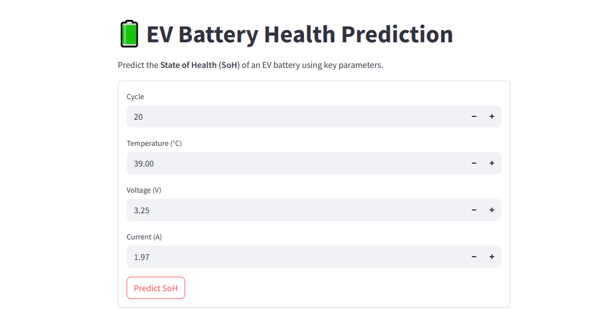
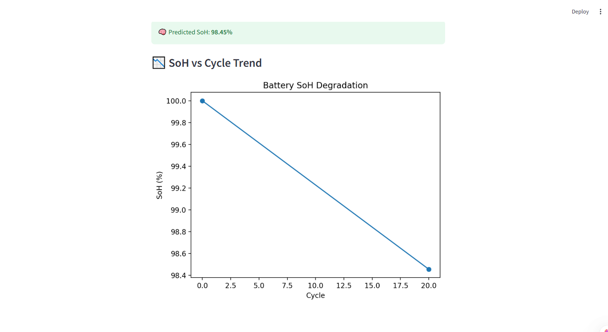

# 🔋 EV-Battery-Health-Prediction-System
This project is a Streamlit-based web application that predicts the State of Health (SoH) of EV batteries using machine learning. Users input real-time parameters—cycle, temperature, voltage, and current—and receive an instant SoH prediction along with a visual trend. Designed for predictive maintenance and battery life monitoring in electric vehicles.

## 📌 Objective :
To develop an AI-powered predictive maintenance system that accurately estimates the State of Health (SoH) of Electric Vehicle (EV) batteries using real-time input parameters such as cycle count, temperature, voltage, and current.

## 🚗 Why This Matters :
EV battery degradation is a major concern for manufacturers and users alike. Predicting the SoH can:
- Enhance battery reliability and lifespan
  
- Reduce unexpected failures

- Support preventive maintenance schedules

- Optimize EV performance and safety

## 🧠 Tech Stack :
- Python: Core programming language

- Streamlit: For building the interactive web dashboard

- Scikit-learn: Machine learning model training

- Pandas / NumPy: Data manipulation

- Matplotlib / Seaborn: Visual analytics

- joblib: For saving/loading trained models

- VS Code: Development environment

## 📸 Preview :
### 1. User Interface – Input Parameters for EV Battery

### 2. Predicted State of Health (SoH) with Degradation Trend

## 🎓 Learning Outcomes :
- Gained hands-on experience with ML model training and deployment.

- Built an interactive web app using Streamlit for real-time SoH prediction.

- Improved skills in data preprocessing, visualization, and model integration.

- Developed understanding of EV battery health metrics and predictive maintenance.

## 📌 License :
This project is for educational and portfolio purposes only.

📎 Please do not reuse or distribute without permission.

© Rahul Bhoyar, All Rights Reserved.

